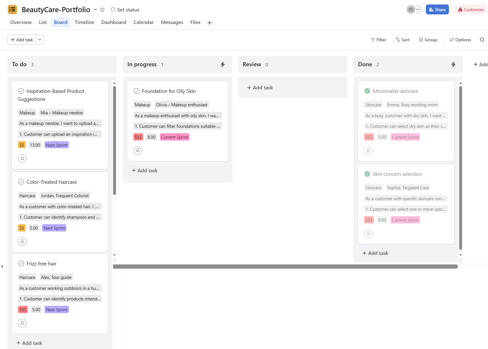
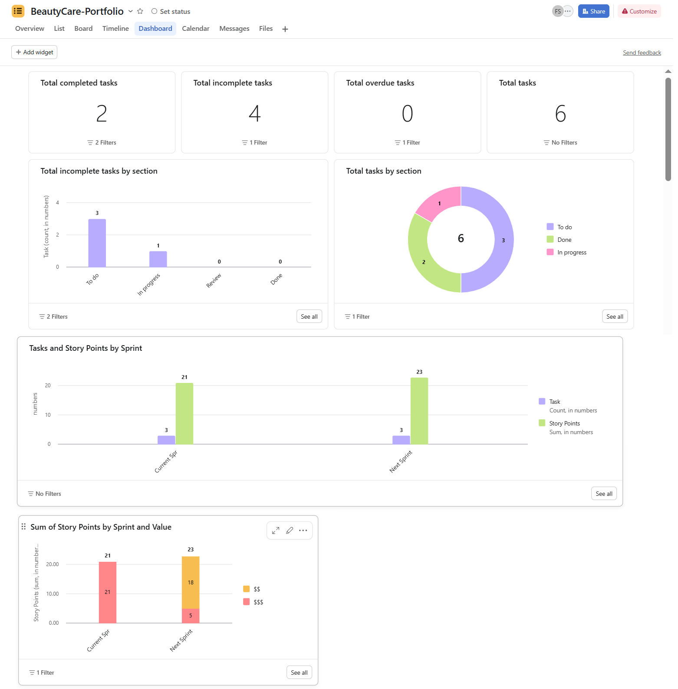
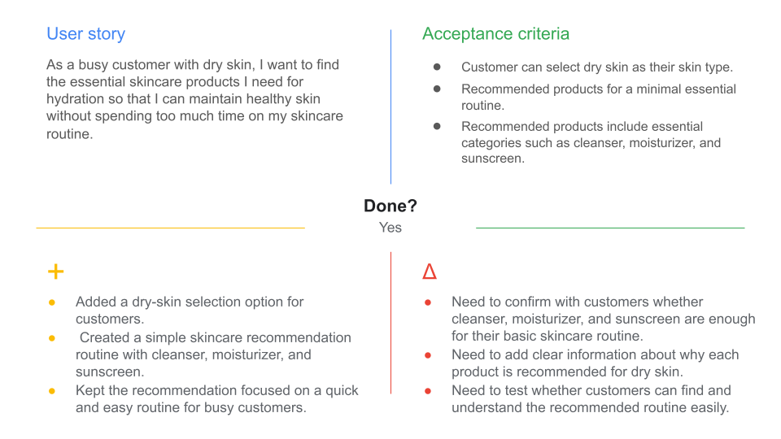
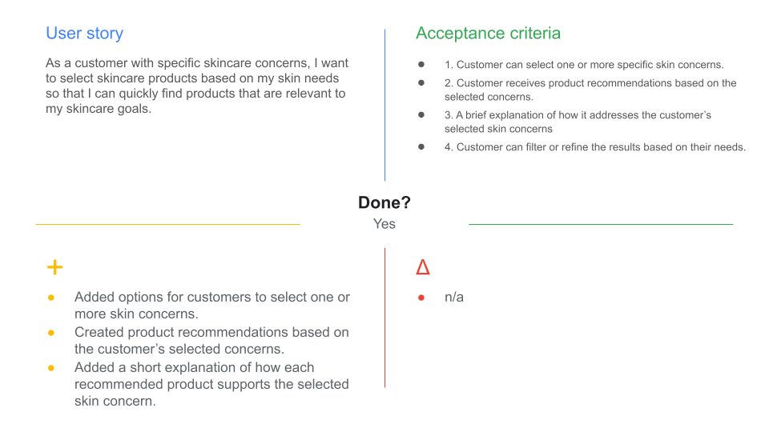
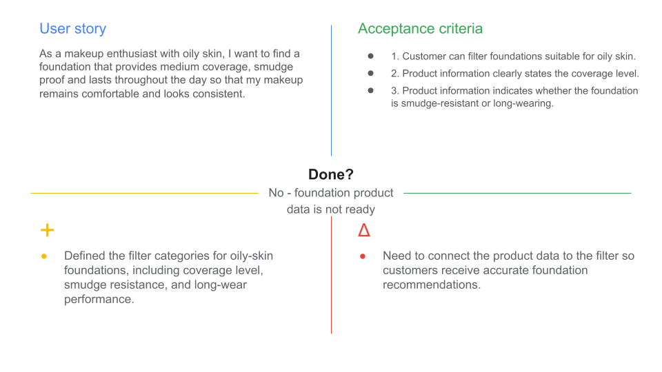

# Beauty Product Management Portfolio
## Project Overview
This is a personal Agile scrum project about planning beauty product features.

The project covers three beauty areas:

- Skincare
- Haircare
- Makeup

The goal is to show how customer needs can be turned into user stories, prioritized by value, 
estimated with story points and planned across two sprints.

## Project Goal
This project demonstrates how Agile Scrum practices can be used to plan and prioritize beauty 
product discovery features that help customers find products based on their needs. The features
are prioritized based on customer and business value, as well as estimated effort.

The project focuses on product management and Agile planning rather than building an actual website,
manufacturing beauty products, managing inventory or marketing products.

## Project Deliverables

This project includes:

- A prioritized **Product Backlog**
- **Epics**
- Customer **personas**
- **User stories** for Skincare, Haircare, and Makeup
- **Acceptance criteria** for each user story
- Business and customer **value ratings**
- **Story points**
- 2 **Sprint backlogs**
- Backlog prioritization and sprint planning
- An Asana Board and Dashboard
- Sprint Review documentation
- Sprint Retrospective documentation and whiteboards
- Lessons learned from planning and tracking the project

## Scope Boundaries

### In Scope

This project includes the planning and prioritization of beauty product-discovery features across Skincare, Haircare, and Makeup.

In-scope work includes:

- Defining product epics
- Creating customer personas
- Writing user stories and acceptance criteria
- Creating and prioritizing a Product Backlog
- Assigning customer and business value ratings
- Estimating work with story points
- Planning Sprint 1 and Sprint 2
- Organizing user stories in Asana
- Tracking workflow status through an Asana Board and Dashboard
- Conducting a Sprint Review and Sprint Retrospective
- Documenting lessons learned and improvement opportunities

### Out of Scope

This project does not include:

- Building a live beauty-product website or mobile application
- Developing functional product-search, filtering, recommendation, or image-upload features
- Manufacturing beauty products
- Managing inventory, suppliers, fulfillment, or shipping
- Creating marketing campaigns or paid advertising
- Processing customer payments or orders
- Collecting real customer data or conducting real customer testing

## Tools Used

| Tool | Purpose |
|---|---|
| Google Sheets | Created and maintained the Product Backlog and Sprint Backlog, including personas, user stories, acceptance criteria, value ratings, story points, sprint assignments, capacity, and sprint comparison. |
| Asana | Organized user stories, managed workflow stages, tracked sprint work, and created Board and Dashboard views. |
| GitHub | Hosted the portfolio documentation, images, and supporting project artifacts. |
| IntelliJ IDEA | Edited Markdown documentation and managed the local Git repository. |

## Product Structure

The product is organized into three primary epics:

### Skincare

Focuses on helping customers find products based on their skin type and skincare concerns.

### Haircare

Focuses on helping customers find products for needs such as frizz control and color-treated hair.

### Makeup

Focuses on helping customers find makeup products based on their skin needs, experience level
and preferences.

## Customer Personas

| Persona | Product Area | Main Need |
|---|---|---|
| Emma – Busy Working Mom | Skincare | Find a simple skincare routine for dry skin |
| Sophia – Targeted Care | Skincare | Find products for specific skincare concerns |
| Alex – Tour Guide | Haircare | Find products that help control frizz in humid weather |
| Jordan – Frequent Colorist | Haircare | Find products suitable for color-treated hair |
| Olivia – Makeup Enthusiast | Makeup | Find foundations suitable for oily skin |
| Mia – Makeup Newbie | Makeup | Find easy makeup product suggestions |

## Example User Story

### Skin Concern Selection

> As a customer with specific skincare concerns, I want to select skincare products based on my
> skin needs so that I can quickly find products that are relevant to my skincare goals.

**Acceptance Criteria:**

1. Customer can select one or more specific skin concerns.
2. Customer receives product recommendations based on the selected concerns.
3. Each recommended product includes a brief explanation of how it supports the selected skin concern.
4. Customer can filter or refine results based on their needs.

The full Product Backlog is available in the [project workbook](workbook/README.md).

## Backlog Prioritization

Each user story was given a value rating and story-point estimate.

| Value | Meaning |
|---|---|
| `$$$` | High value |
| `$$` | Medium value |
| `$` | Lower value |

The highest value tasks are done first, rest later.
Story points show the amount of effort or difficulty a task may need. They do not
show the number of hours needed.

## Sprint Planning

The project is planned across two sprints.

| Sprint | Focus | Total Story Points |
|---|---|---:|
| Sprint 1 | High-value customer needs | 21 |
| Sprint 2 | Remaining planned features | 23 |

Sprint 2 has more story points than Sprint 1 but Sprint 1 has more value - preferred in Agile.

Sprint 2 includes more work overall but Sprint 1 focuses on the tasks that are most important
to customers and the business.

Story points show the amount of effort needed for a task. Value shows how helpful or important
that task is.

More details are available in the [Sprint 1 Plan](project-docs/1.sprint-1-plan.md) and [Sprint 2 Plan](project-docs/2.sprint-2-plan.md).

## Asana Project Views

### Asana Board

I have organized user stories in the Asana Board by workflow stage: To do, In progress, Review and Done.



### Asana Dashboard

The Asana Dashboard shows task status, completed and incomplete work, story-point totals, and task completion over time.



## Sprint Review and Retrospective

Sprint 1 included a review of completed work and a retrospective to identify what went well (denoted by symbol '+')
and what could be improved for the next sprint (denoted by symbol 'Δ').


Project documents:

- [Sprint Review and Retrospective](project-docs/sprint-review-retrospective.md)
- [Sprint Retrospective Follow-Up Email](project-docs/4.sprint-1-retrospective-email-template.md)
- [Lessons Learned](project-docs/5.lessons-learned.md)

### Sprint 1 Retrospective Whiteboards







## Project Workbook

The Google Sheets workbook includes the full Product Backlog, customer personas, user stories,
acceptance criteria, value ratings, story points, Sprint 1 and Sprint 2 plans and sprint comparison.

[Open the Project Workbook](workbook/README.md)

## Final Takeaway

This project demonstrates an iterative approach to product management:

```text
Understand Customers
        ↓
Create Personas
        ↓
Write User Stories
        ↓
Build the Initial Backlog
        ↓
Identify Gaps and Refine
        ↓
Estimate Effort and Value
        ↓
Prioritize
        ↓
Plan Two Sprints
        ↓
Review Outcomes
        ↓
Learn and Iterate
```

The project demonstrates that effective product management is not simply about creating more features. It is about understanding which customer problems are worth solving, why they matter, and when they should be delivered.
## Repository Structure

```text
BeautyCare-Portfolio/
│
├── README.md
│
├── workbook/
│   └── README.md
│
├── project-docs/
|   ├── 0.repository-setup.md
│   ├── 1.sprint-1-plan.md
│   ├── 2.sprint-2-plan.md
│   ├── 3.sprint-review-retrospective.md
│   ├── 4.sprint-retrospective-email-template.md
│   └── 5.lessons-learned.md
│
└── images/
    ├── asana-board.jpg
    ├── asana-dashboard.jpg
    ├── sprint-1-retrospective-whiteboard-1.png
    ├── sprint-1-retrospective-whiteboard-2.png
    └── sprint-1-retrospective-whiteboard-3.png
```